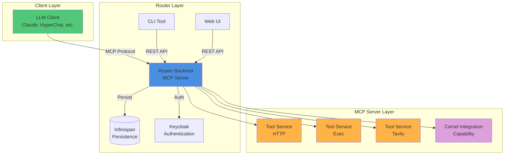
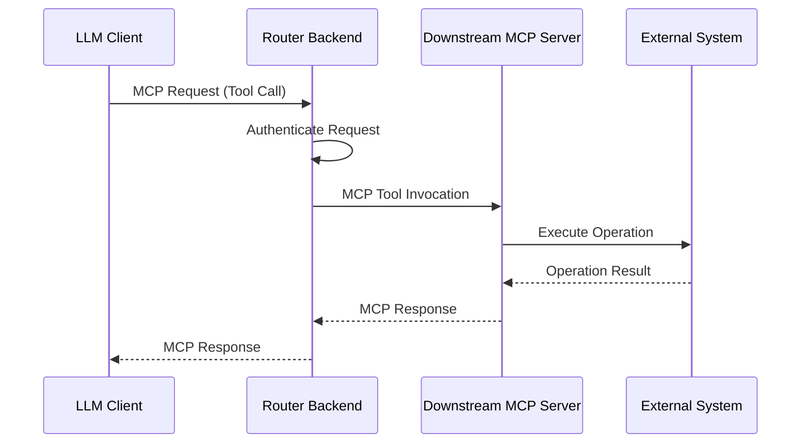
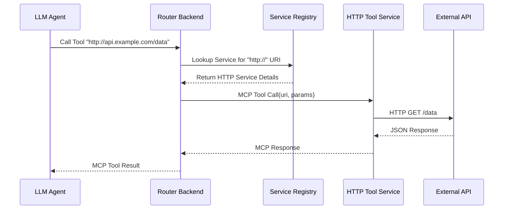
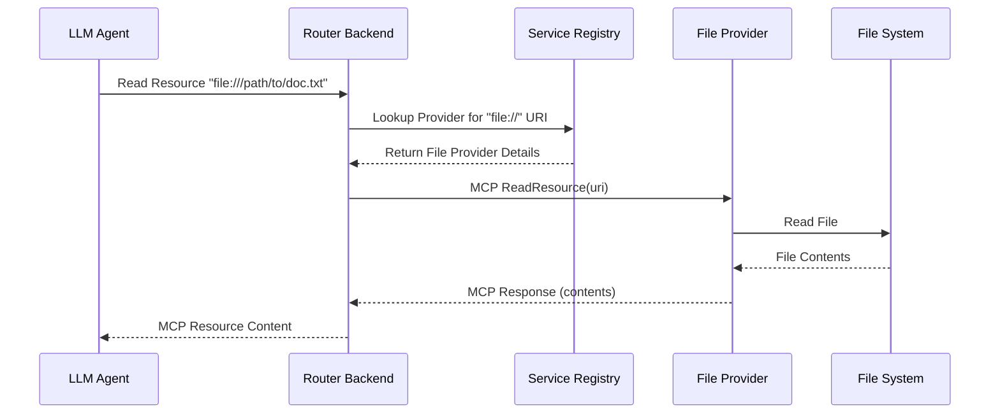
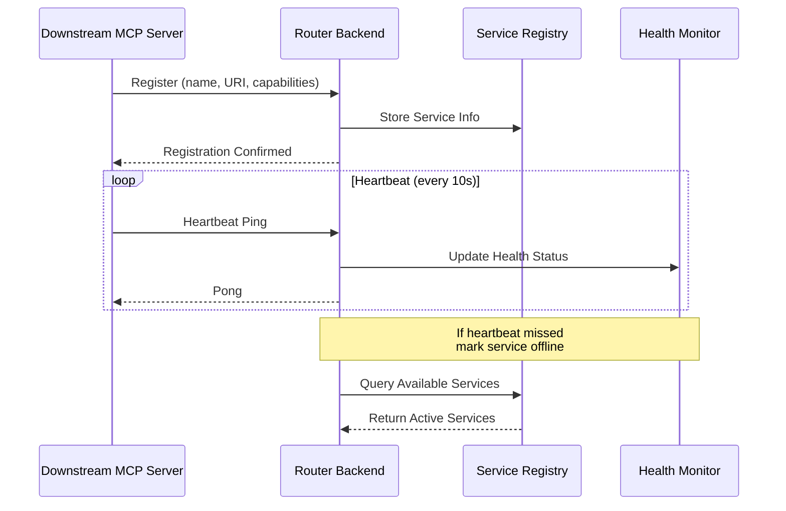
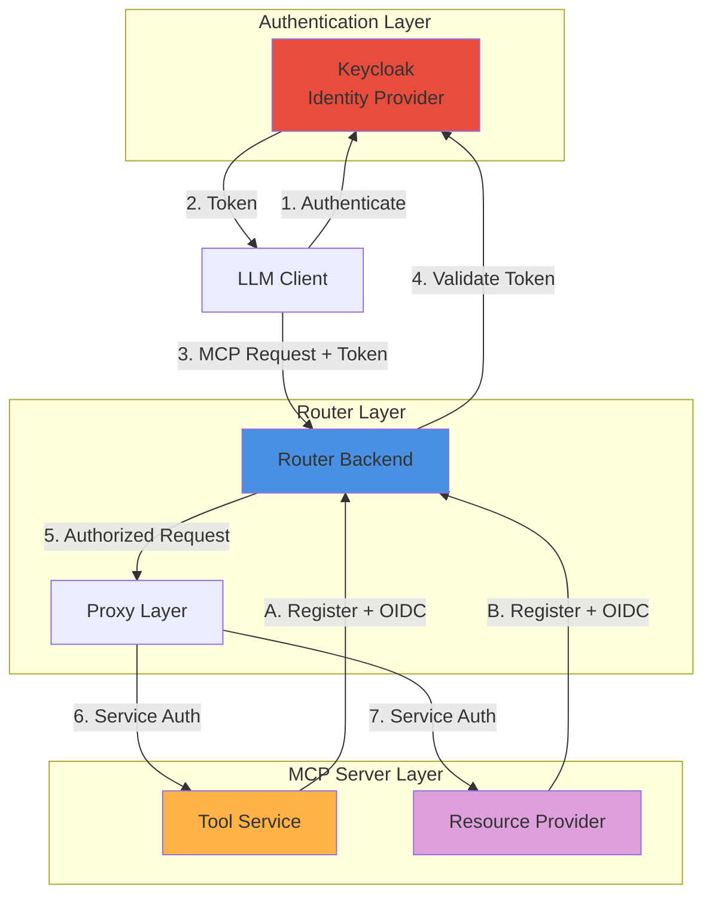
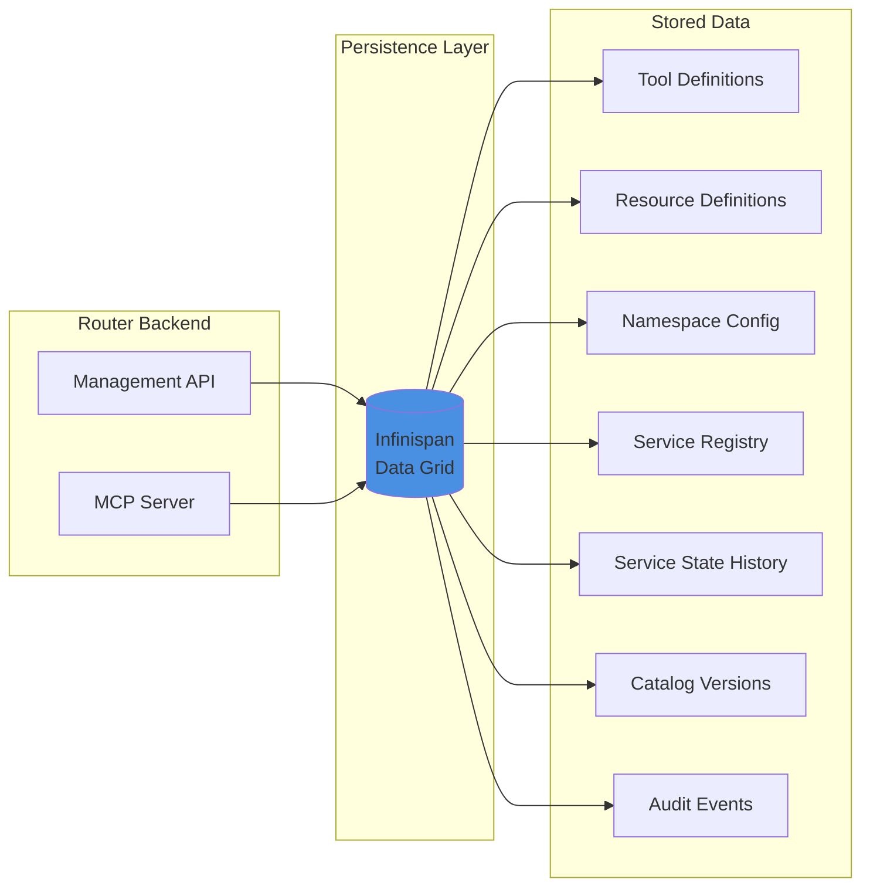
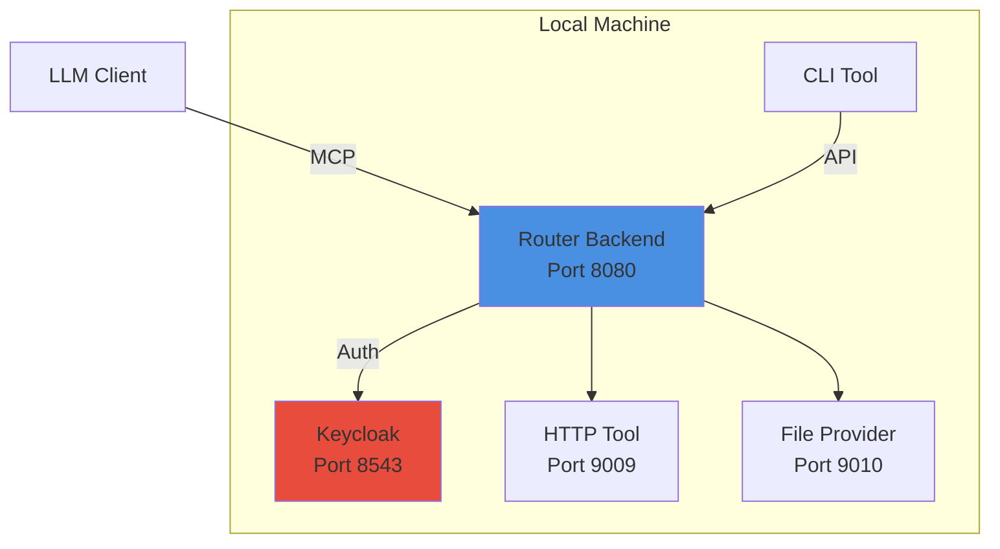
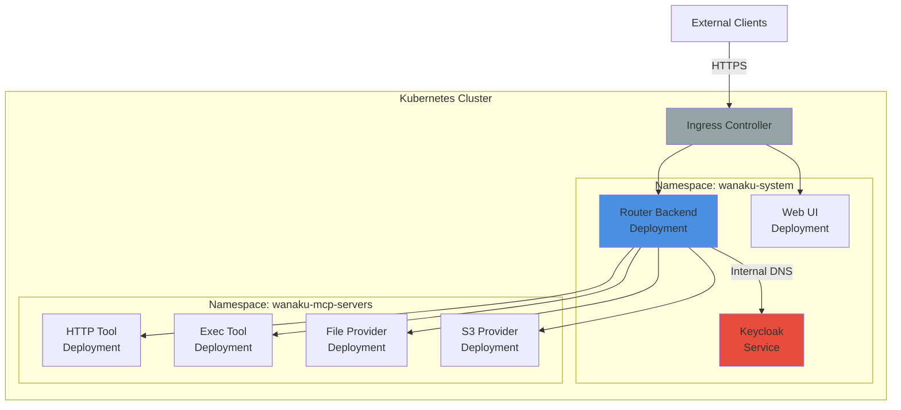

# Wanaku MCP Router Architecture

## Overview

The Wanaku MCP Router is a distributed system for managing Model Context Protocol (MCP) workloads, providing a flexible and extensible framework for integrating AI agents with enterprise systems and tools.

### Key Architectural Principles

- **Separation of Concerns**: Router backend handles protocol and routing; downstream MCP servers handle actual operations
- **Service Isolation**: Each MCP server runs independently for security and reliability
- **Protocol Abstraction**: MCP protocol details are handled by the router; services focus on business logic
- **Dynamic Discovery**: Services register themselves at runtime, enabling flexible deployment

### High-Level Architecture

Wanaku doesn't directly host tools or resources. Instead, it acts as a central hub that manages and governs how AI agents access specific resources and tools through registered MCP servers.

> [!NOTE]
> The primary MCP routing engine is now [Wanaku Praxis](https://github.com/wanaku-ai/wanaku), a Rust-based router.
> This repository (wanaku-barn) provides the "Classic Wanaku" Java backend for persistence, service catalogs, the operator, and administration.
> For detailed information about the backend's internal implementation, see [Wanaku Router Internals](wanaku-router-internals.md).

## System Components

### Core Router Components

#### Router Backend (`wanaku-barn-backend`)

The main MCP server engine that:

- Receives MCP protocol requests from AI clients (SSE and HTTP transports)
- Routes tool invocations to appropriate tool services
- Routes resource read requests to appropriate providers
- Manages tool and resource registrations across namespaces
- Provides HTTP management API for configuration
- Handles authentication and authorization via Keycloak

**Technology Stack**: Quarkus, Quarkus MCP Server Extension, Infinispan

#### CLI (`cli`)

Command-line interface for router configuration and management:

- Tool and resource management
- Namespace configuration
- MCP server monitoring
- Project scaffolding for new MCP servers
- OAuth 2.0/OIDC authentication

#### Web UI (`ui`)

React-based administration interface:

- Visual tool and resource management
- MCP server status monitoring
- Configuration management
- User authentication via Keycloak

### Downstream MCP Servers

Downstream MCP servers extend the router's functionality by providing specific tools or resource access.

#### Tool Services

Tool services provide LLM-callable capabilities through the MCP protocol:

| Service | Purpose | Technology |
|---------|---------|------------|
| **HTTP Tool Service** | Make HTTP requests to REST APIs and web services | Apache Camel |
| **Exec Tool Service** | Execute system commands and processes | Native execution |
| **Tavily Tool Service** | Search integration through Tavily API | Tavily SDK |

#### Resource Providers

Resource providers enable access to different data sources and storage systems.

Wanaku does not come with any resource provider out of the box,
but you can find some in the [Wanaku Examples repository](https://github.com/wanaku-ai/wanaku-examples).

### Core Libraries

Shared libraries providing foundational functionality:

| Library | Purpose |
|---------|---------|
| **core-mcp-client** | MCP protocol client for communicating with downstream MCP servers |
| **core-services-api** | Service API interfaces for tools, resources, namespaces, and services |
| **core-service-discovery** | Service registration and health monitoring |
| **core-util** | Common utilities, constants, and helper classes |

### Development Tools

| Tool | Purpose |
|------|---------|
| **[Wanaku Capabilities Java SDK](https://github.com/wanaku-ai/wanaku-capabilities-java-sdk)** | SDK and archetypes for creating new MCP servers |

## Architecture Patterns

### Distributed Microservices Architecture

Wanaku follows a distributed microservices architecture where the central router coordinates with independent provider and tool services:

- **Router as Gateway**: Central entry point for all MCP requests
- **Service Independence**: Each downstream MCP server runs as an independent process
- **Protocol Translation**: Router handles MCP protocol for both clients and downstream MCP servers
- **Horizontal Scalability**: Services can be scaled independently

### Request Flow

**Flow Steps:**

1. **Client Connection**: LLM client connects to router backend via MCP protocol (SSE or HTTP)
2. **Authentication**: Router authenticates the request using Keycloak/OIDC
3. **Request Processing**: Router receives MCP requests (tool calls, resource reads, prompt requests)
4. **Service Routing**: Router determines the appropriate downstream MCP server based on tool/resource type and namespace
5. **Service Communication**: Router forwards request to the downstream MCP server via MCP
6. **Service Processing**: Downstream MCP server handles actual resource access or tool execution
7. **Response**: Results flow back through the router to the client

### Tool Invocation Flow

### Resource Read Flow

### Service Discovery and Registration

The router maintains a dynamic service registry that tracks available downstream MCP servers.

**Registration Process:**

1. **Service Startup**: Downstream MCP server starts and loads configuration
2. **Authentication**: Service authenticates with router using OIDC client credentials
3. **Registration**: Service registers itself with router, providing:
   - Service name and type
   - Service endpoint address
   - Supported capabilities (tool types or resource protocols)
   - Configuration schema
4. **Health Monitoring**: Service sends periodic heartbeats to indicate availability
5. **Dynamic Discovery**: Router updates service registry and makes services available
6. **Deregistration**: Service deregisters on shutdown or is marked offline after missed heartbeats

### Namespace Isolation

Namespaces provide logical isolation for organizing tools and resources:

- **Default Namespace**: Standard workspace for general-purpose tools and resources
- **Custom Namespaces** (ns-1 through ns-10): Isolated environments for specific use cases
- **Public Namespace**: Read-only access to shared tools and resources
- **Isolation**: Tools and resources in one namespace are not visible to clients connected to another

### Security Architecture

**Security Layers:**

1. **Client Authentication**: LLM clients authenticate via OIDC with Keycloak
2. **Token Validation**: Router validates access tokens for each request
3. **Service-to-Service Auth**: Downstream MCP servers use client credentials to authenticate with router
4. **RBAC** (Future): Role-based access control for fine-grained permissions
5. **Provisioning Security**: Sensitive configuration delivered via encrypted channels

### Data Persistence

Wanaku uses Infinispan embedded data grid for persistence:

- **Tool Definitions**: Registered tools with URIs, labels, and configuration
- **Resource Definitions**: Registered resources with URIs and metadata
- **Namespace Configuration**: Namespace settings and mappings
- **Service Registry**: Active downstream MCP servers and their health status
- **Service State History**: The recent states of each registered service (healthy, unhealthy, down). `wanaku.persistence.infinispan.max-state-count` limits the list. This history does not store configuration snapshots.
- **Catalog Versions**: Immutable versions of service catalogs and templates, which you can restore. See [Version History](service-catalogs.md#version-history).
- **Audit Events**: A durable record of changes to the managed resources. See [Barn Audit Trail](audit-trail.md).

### Extensibility Model

New MCP servers can be added through multiple approaches:

#### 1. Tool Services

**Steps:**

1. Use the [Wanaku Capabilities Java SDK](https://github.com/wanaku-ai/wanaku-capabilities-java-sdk) archetypes to generate a project
2. Implement tool logic using Java/Camel or other supported language
3. Configure service registration and OIDC credentials
4. Deploy service (standalone or containerized)
5. Service auto-registers with router on startup

#### 2. Resource Providers

Similar pattern to tool services, using the `wanaku-provider-archetype` from the Java SDK

#### 3. MCP Server Bridging

Wanaku can aggregate external MCP servers, presenting them as unified services.

#### 4. Apache Camel Integration

Leverage 300+ Camel components for rapid integration:

- Kafka, RabbitMQ, ActiveMQ
- AWS, Azure, Google Cloud services
- Databases (SQL, MongoDB, etc.)
- Enterprise systems (SAP, Salesforce, etc.)

## Design Decisions

### Why Separate Router and MCP Servers?

- **Isolation**: Failures in one MCP server don't affect others
- **Independent Scaling**: Scale services based on demand
- **Technology Flexibility**: Use different tech stacks per service
- **Security**: Contain potential vulnerabilities to specific services

### Why Infinispan for Persistence?

- **Embedded**: No external database dependency for simple deployments
- **Performance**: In-memory data grid with fast access
- **Clustering**: Supports distributed deployments (not used: Barn runs one process per data directory)
- **Consistency**: Each write changes one entry atomically. Conditional writes (revision checks) prevent lost updates. Barn does not use transactions, so an operation that changes more than one entry is not atomic across a crash.

## Deployment Architectures

### Local Development

**Characteristics:**

- All components run on localhost
- Simple podman/docker setup for Keycloak
- Easy debugging and development
- No network complexity

### Kubernetes/OpenShift Deployment

**Characteristics:**

- Production-grade deployment
- Service discovery via Kubernetes DNS
- Horizontal pod autoscaling
- ConfigMaps and Secrets for configuration
- Health checks and rolling updates

## Performance Considerations

### Throughput

- **MCP Requests**: Router handles concurrent requests asynchronously using Mutiny `Uni` types
- **Async Processing**: Non-blocking I/O throughout the stack

### Latency

Typical request latency breakdown:

| Component | Latency | Notes |
|-----------|---------|-------|
| MCP Protocol Overhead | ~5ms | SSE/HTTP serialization |
| Router Processing | ~10ms | Routing, auth validation |
| Service Communication | ~2ms | Internal network |
| MCP Server Processing | Variable | Depends on operation |
| **Total (excluding operation)** | **~17ms** | Overhead without actual work |

### Scaling Strategies

1. **Vertical Scaling**: Increase router resources for higher throughput
2. **Horizontal Scaling**: Multiple router instances behind load balancer (future)
3. **MCP Server Scaling**: Scale individual downstream MCP servers based on demand
4. **Caching**: Infinispan caching reduces repeated lookups

## Related Documentation

- **[Wanaku Router Internals](wanaku-router-internals.md)** - Deep dive into proxy architecture and implementation
- **[Configuration Guide](configurations.md)** - Complete configuration reference
- **[Contributing Guide](../CONTRIBUTING.md)** - How to extend Wanaku with new MCP servers
- **[Security Guide](../SECURITY.md)** - Security best practices and policies
- **[Usage Guide](usage.md)** - Operational guide for using Wanaku
